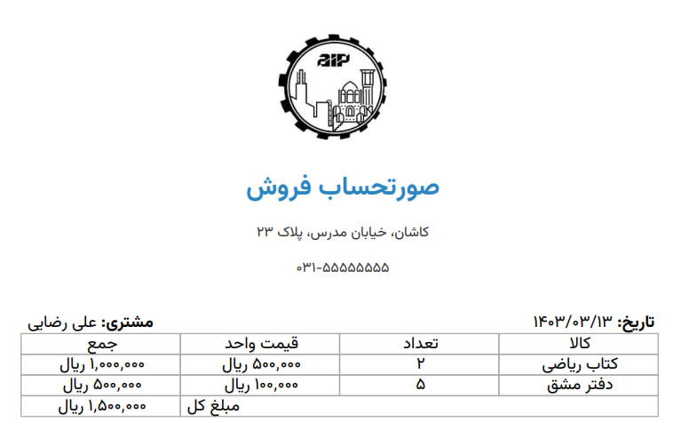

# tcpdf-utf8-php-example

A simple PHP project demonstrating how to generate right-to-left (RTL) **Persian invoices** as PDFs using [TCPDF](https://github.com/tecnickcom/TCPDF). This setup supports full **UTF-8 rendering**, **custom Persian fonts**, and is ready to clone, run, and customize.

## ✨ Key Features

- Generates **Persian-language invoices** with correct RTL layout
- Handles **UTF-8 non-ASCII characters**
- Loads and embeds **custom Persian fonts** (`Vazirmatn-Medium`)
- Supports multiple PHP versions (see compatibility section)

> Tested in PHP 8.3 - Windows OS and php 8.4 - Ubuntu OS.

[](invoice.pdf)

---

## ⚠️ Challenges Covered

This example solves common issues when working with Persian (Farsi) PDFs in PHP:

- ✅ Right-to-left text layout
- ✅ UTF-8 character support (Arabic script, numbers)
- ✅ Custom TTF font loading and usage in TCPDF

> ℹ️ The example uses [Vazirmatn](https://github.com/rastikerdar/vazirmatn/releases/tag/v33.003), a high-quality Persian typeface by the late **VazirMatn** – a respected contributor to the Persian design community. Best and be at peace.

---

### Required PHP Extensions

Make sure the `gd` extension is enabled in your `php.ini`.

---

## 📦 Installation

```bash
git clone https://github.com/BaseMax/tcpdf-utf8-php-example.git
cd tcpdf-utf8-php-example
composer install
php -S localhost:8000
```

Then open http://localhost:8000/invoice.php in your browser.

**Read more:** https://tcpdf.org/

---

## 📄 License

MIT License

© 2025 Max Base
